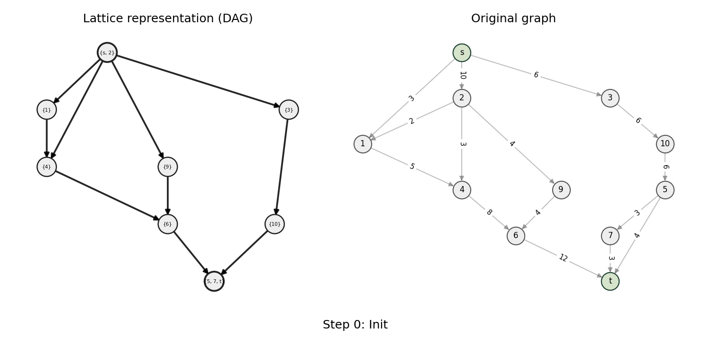

# Max-Disjoint Solutions Framework
This repository provides a generic C++17 framework for computing sets of pairwise disjoint feasible solutions in combinatorial-optimization problems whose feasible sets form a distributive lattice.
It implements the general algorithmic scheme of “Max-Disjoint Solutions” introduced in [dBMS25], allowing different optimization problems (e.g., minimum s-t cut & stable matching) to plug into the same high-level interface via three problem-specific oracles. 

<p align="center">
  <br/>
  <em>Example: Max-Disjoint Minimum s-t Cuts</em>
</p>

## Overview
The project defines an extensible base class `MaxDisjointSolutionsFramework<LatticeGraph, InternalSolution, ExternalSolution>`.  

Each subclass must specify:  
- **`O_min(L*)`** – returns the minimal solution of the current sublattice `L*`,  
- **`O_max(L*)`** – returns the maximal solution,  
- **`O_ds(L*, S)`** – restricts the current sublattice `L*` to the disjoint successors of `S`.  

The framework then executes the generic Max-Disjoint algorithm—iteratively selecting minimal solutions and shrinking the current sublattice—until no further disjoint solutions exist.

Two example subclasses are included, implemented with the **Boost Graph Library (BGL)**:
- **`ToyPowersetMDS`** – a minimal powerset-based mock problem used for unit testing.  
- **`MinCutMaxDisjoint`** – a concrete implementation for the *Minimum s-t Cut* problem. 
---

## Contents
```bash
.
├── bin/                                # Folder for built application binary
│   └── mds_framework                   # Built application executable
├── build/                              # CMake build folder
│   └── test/                           # Compiled test folder
│       └── mds_framework_unit_tests    # Built unit tests executable
├── cmake/                              # Folder for cmake configuration files
│   └── local.cmake                     # File with local env variables (e.g., Boost path)
├── include/                            # Folder for all header files
├── input/                              # Folder for some test input files
├── src/                                # Folder for all source files
│   └── main.cpp                        # Main entry of the application
├── test/                               # Test folder for all unit tests
│   └── CMakeLists.txt                  # Compile script for unit tests
└── CMakeLists.txt                      # Main compile script
```

## Requirements
- **CMake ≥ 3.22**
- **C++17-compatible compiler** 
- **Boost ≥ 1.89** (header-only components suffice)

## Building
From the project root
```bash
mkdir build
cd build
cmake ..
```
This build the project binaries into `bin/` and compiles all tests under `build/test/`.

## Running
Run the main executable:
```bash
./bin/mds_framework
```
Run all unit tests (via CTest):
```bash
cd build/test
ctest -V
```
or directly:
```bash
./build/test/mds_framework_unit_tests
```

## Extending the Framework
To add a new problem **X**:
1. Create a subclass class `XMaxDisjoint : public MaxDisjointSolutionsFramework<...>`.
2. Implement `build_initial_lattice()`, `O_min()`, `O_max()`, `O_ds()`, `are_disjoint()`, `is_empty()`, and `convert_to_solution_space`.
3. Compile and test using the same CMake structure.

## References
[dBMS25] - Mark de Berg, Andrés López Martínez, and Frits Spieksma. *Finding diverse solutions in
combinatorial problems with a distributive lattice structure*, 2025. URL: [https://arxiv.org/abs/2504.02369](https://arxiv.org/abs/2504.02369) — *arXiv:2504.02369*. 
